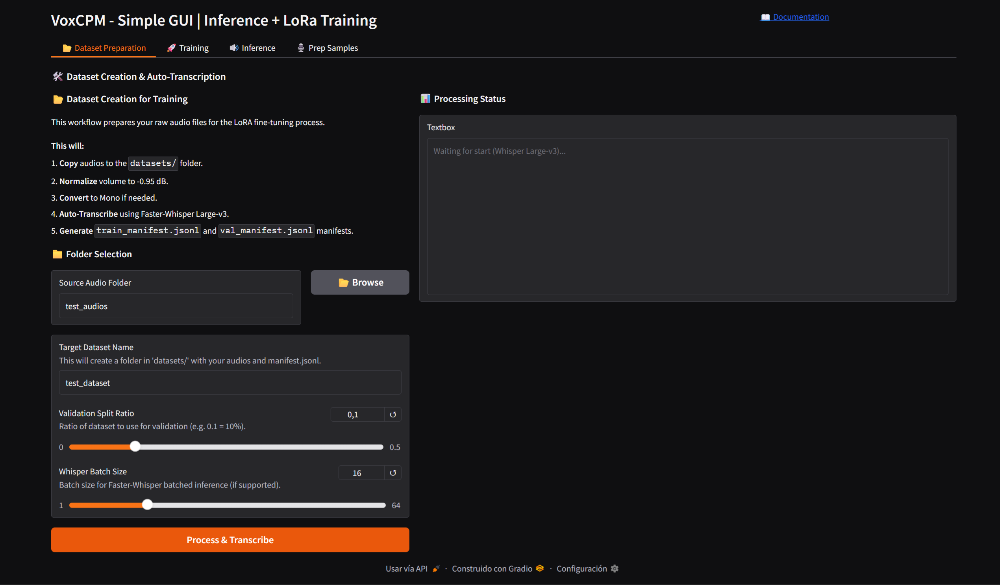
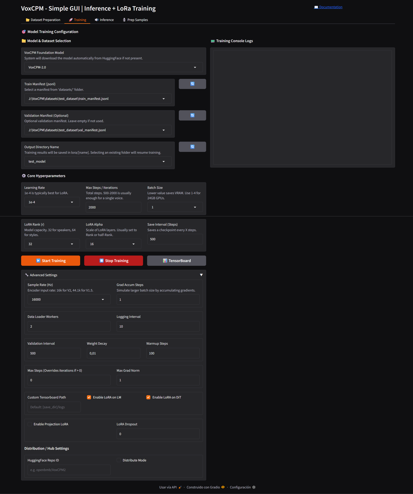
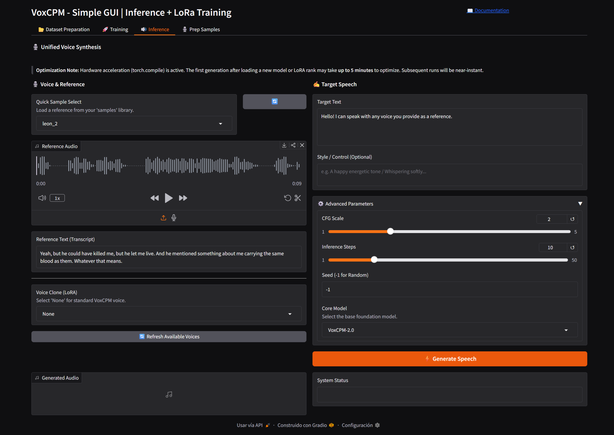
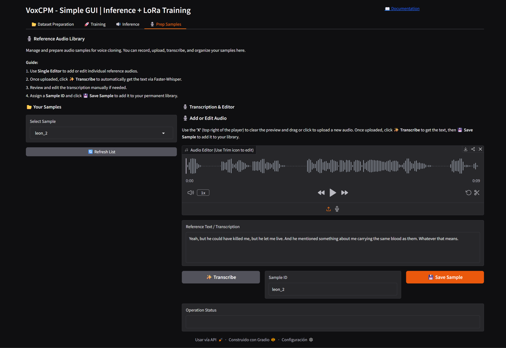
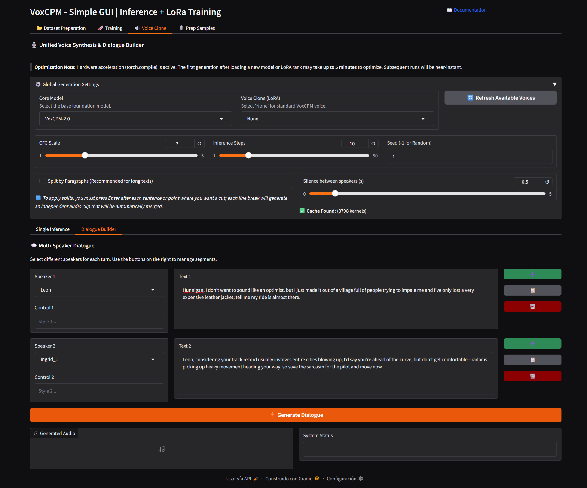

# 🎙️ VoxCPM WebUI: Voice Cloning & Fine-Tuning

A comprehensive WebUI for fine-tuning and interacting with **VoxCPM** models. This application leverages Efficient LoRA (Low-Rank Adaptation) capabilities to enable high-quality voice cloning.









### 2026-04-24 - Add of Dialogue Builder - Multi Speaker Support Inference
We've introduced a **Dialogue Builder** sub-tab within the Voice Clone interface, designed for creating multi-speaker interactions easily:

*   **Dynamic Row Management**: Effortlessly build dialogues by adding (`➕`), cloning (`📋`), or removing (`🗑️`) speaker segments. 
*   **Multi-Speaker Support**: Assign a different voice sample and custom text to every segment in the conversation.
*   **Sequential Synthesis**: Generates each segment independently using the shared global settings (Engine, Model, Temperature, etc.) and automatically concatenates them.
*   **Customizable Silences**: Control the natural flow of the conversation with a dedicated slider to adjust the duration of silence (0 to 5 seconds) between each speaker.
*   **Internal Audio Mastering**: Every output is automatically volume normalized before rendering, ensuring professional consistency across all segments.



---

## 🔄 Application Workflow

1.  **Data Preparation:** Upload/record audio and generate transcriptions using `Faster-Whisper`.
2.  **Fine-Tuning:** Configure LoRA or Full Fine-Tuning parameters and train your voice adapter.
3.  **Inference:** Generate speech using the base model combined with your trained weights.

*   **Persistent Torch & Triton cache**: Integration of `triton-windows` and a custom kernel caching system in `models/.cache`, enabling the full power of `torch.compile` for inference speed-up.
*   **Building the persistent cache for the first time, might take a up to 5 minutes. This is a one time process. Once cached, Subsequent generations will be significantly faster.**

---

## ⚙️ System Requirements & Hardware

### 💻 Software Dependencies
* **Python:** 3.10 – 3.11 (Recommended for stability during training).
* **PyTorch:** 2.5.0+
* **CUDA:** 12.0+
* **Format Support:** `.wav` is recommended.

### 🔌 Hardware Setup (VRAM Requirements)

| Model | LoRA Training |
| :--- | :--- |
| **VoxCPM 1.5 (750M)** | ~12 GB VRAM |
| **VoxCPM 2.0 (2B)** | ~20 GB VRAM |

---

## 📊 Dataset & Audio Specifications

### 🎯 Clip Requirements
* **Format:** `.wav` is highly recommended. Other formats supported by `torchaudio` also work.
* **Duration:** **3–30 seconds** per clip is the "sweet spot."
    * *Warning:* Clips < 1s produce unstable results.
    * *Warning:* Very long clips increase VRAM usage and may be filtered by `max_batch_tokens`.
* **Sample Rate:** The dataloader resamples automatically. Your config `sample_rate` must match the **AudioVAE encoder** input:
    * **VoxCPM 1.0:** 16kHz
    * **VoxCPM 1.5:** 44.1kHz
    * **VoxCPM 2.0:** 16kHz (The encoder operates at 16kHz; the decoder outputs 48kHz).

### ✨ Preprocessing Tips
* **Trim Trailing Silence:** Keep silence to **< 0.5 seconds**. Excessive trailing silence is the leading cause of "infinite generation" issues after fine-tuning.
* **Normalize Volume:** Ensure consistent levels across all training samples.
* **Clean Transcripts:** Text must match audio **exactly**. Inaccurate transcripts degrade both cloning quality and text adherence.
* **Remove Noise:** The model is highly sensitive to background noise. Use clean, isolated voice recordings.

## 💻 Hardware Requirements

- **Inference (Running the model):**
  - Minimum: **8 GB VRAM**
  - Recommended: **12 GB VRAM**
- **Training (LoRA):**
  - Minimum: **+12 GB VRAM** (VoxCPM 1.5) 
  - Recommended: **+20 GB VRAM** (VoxCPM 2.0)

---

## Clone the repository:

```bash
git clone https://github.com/Mixomo/VoxCPM2_Simple_GUI.git

cd VoxCPM2_Simple_GUI
```

## 🛠️ Installation & Execution (Windows)

This project utilizes `uv` for lightning-fast dependency management.

### Setup Steps
1.  **Run Installer:** Double-click `install.bat`.
    * This installs `uv` via Winget (if not present).
    * Synchronizes the environment and installs all required libraries automatically.
2.  **Launch App:** Double-click `start.bat`.
3.  **Access:** Navigate to `http://127.0.0.1:7860` in your web browser.

---

Inspired by [FranckyB](https://github.com/FranckyB) [Voice Clone Studio](https://github.com/FranckyB/Voice-Clone-Studio)

Based on [VoxCPM2](https://github.com/OpenBMB/VoxCPM) by [OpenBMB](https://github.com/OpenBMB)

